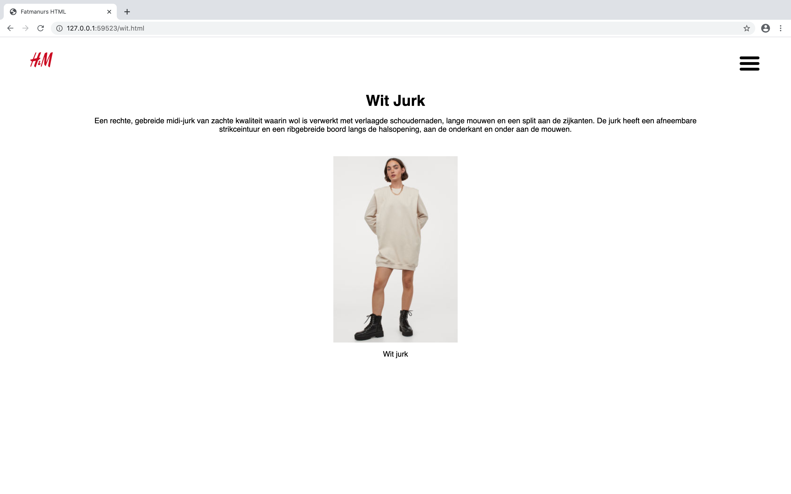

# Procesverslag
**Auteur:** Fatmanur Oraz

## Bronnenlijst

1. Hamburger interactie: //https://codepen.io/rouws/pen/yLLYJgp (code van sonja rouwhorst gekregen bij uitleg vorig jaar), codepen ROUWS is beschikbaar voor iedereen
2. Transform: translate: https://webplatform.github.io/docs/css/functions/translateY/#:~:text=Transform%20function%20for%20a%202d,negative%20lengths%20shift%20it%20up & https://css-tricks.com/almanac/properties/t/transform/
3. Flexbox css: https://css-tricks.com/snippets/css/a-guide-to-flexbox/
4. Meer artikelen: https://www.markuptag.com/javascript-load-more-content-on-click-button/
5. :hover selector: https://www.w3schools.com/cssref/sel_hover.asp
6. Alle content qua afbeeldingen, tekst: https://www2.hm.com/nl_nl/dames/shop-by-product/jurken.html
7. Grid change voor product pagina: Jelmer
8. Grid columns: https://css-tricks.com/almanac/properties/g/grid-rows-columns/ & https://developer.mozilla.org/en-US/docs/Web/CSS/grid-template-columns

## Week na het eindgesprek, voor de herkansing (week 8/9)

Na het eindgesprek ben ik meteen begonnen met het toepassen van de feedback, ik heb alle js eruit gehaald en alles geprobeerd aan te passen in mn html en css. Al gauw kwam ik erachter dat dit veelste lang zou duren en het super ingewikkeld zou zijn omdat de code niet echt "in mijn taal" was geschreven. Daarom ben ik helemaal vanaf het begin begonnen en een nieuwe website gemaakt. Janno zei dat ik mij moest focussen op 1 interactie, dus heb ik mijn focus omgezet van surface plane naar responsive. Achteraf gezien had ik dit op het begin al moeten doen, I was reaching a bit too high denk ik.

Binnen een aantal dagen was mijn "nieuwe" code toe aan feedback zodat ik kon inschatten hoe ik verder moest gaan, dus heb ik Jelmer een berichtje gestuurd en hebben wij er samen naar gekeken, screenshots van deze versie zie je hieronder:

Hieruit kwam als feedback het volgende:

Wat mist er:
- Logo staat in niet midden, dit haalt meteen al weg van de "H&M experience"
- Tabjes dames, heren etc. mist
- Footer mist, moet er sowieso in staan
- Magazine onderaan hun eigen pagina, is een goede opdracht om dit vak te oefenen (na de feedback sessie besefte ik mij dat dit onderdeel NIET op de jurken-pagina van H&M staat, maar op de homepagina, dit heb ik Jelmer laten weten en toen zei hij dat het dan uiteraard niet hoefde: hij had verkeerd gekeken)

- Productpagina: Klein (op mobiel) moet er 1 fotootje zijn (2 onderelkaar) dus niet 2 kleinere fotos, groot (web) moeten het er 2 naast elkaar zijn.
- Productpagina sowieso wat aan de "droge" kant
- Als je m kleiner maakt gaat de prijs naar onder ipv rechts blijvenstaan.
- Bevat verschillende content: kijk wat er allemaal nog bij kan. Nu heb ik eigenlijk alleen maar een hamburgermenu zonder andere navigatie. Zie lijstje wat mist er en voeg die elementen toe, dus nogmaals: tabjes met dames heren etc, en footer.
- Professionele uitstraling: het moet in de huisstijl zijn van h&m!! Nu is dat nog niet echt het geval, begin in ieder geval met het logo in het midden neer te zetten. kijk goed naar de H&M website.

Na deze feedback gehad te hebben ben ik weer aan de slag gegaan en dit toegepast, deze feedback verwerken was niet zo moeilijk: ik weet hoe ik een afbeelding moet centreren en hoe ik een footer toevoeg aan een pagina. Ik moest alleen even opzoeken hoe ik ookalweer de navigatie bovenin, dames, heren etc., moest vormgeven met de hover, en dat heb ik opgezocht en uitgevonden.

Zie screenshots van deze versie hieronder:

Vervolgens weer een gesprek gehad met Jelmer en nieuwe feedback gehad:

- Meer producten en dat ze echt naast elkaar staan ipv ruimte ertussen
- Meer producten laden knop (hoeft niet te werken) OF als je naar de productpagina gaat: knop toevoegen aan winkelmand erbij (hoeft ook niet te werken)
- Navigatie links toevoegen, bijv: “nieuwe items, bekijk alle items, kleding, lingerie & nachtkledij, schoenen & accessoires” (paar kopjes dus , niet alles hoeft)
- Er is 1 class bij img. in de nav. waarom zou je een class gebruiken? leg dit uit en dan is het okee. (Nou; omdat je een functie aanspreekt in js waarin je de classes toevoegt. Je kan niet een complexe code schrijven in JS als je de styling wilt veranderen van een element, en geen classes gebruiken. Hoe ga je een class toggelen als je geen class mag gebruiken? Edit is de enige manier waarop ik t heb geleerd.)
- Sections en Articles moeten omgedraaid worden, section moet een article zijn en article moet section zijn. (in productpaginas bijv. paars.html)

Wat ik hierbij lastig vond was vooral het indelen van de grids, hierbij heeft 1 artikel mij eigenlijk van start tot einde mee geholpen en dat was: https://developer.mozilla.org/en-US/docs/Web/CSS/grid-template-columns. Het andere artikel wat in mn bronnen staat hielp mij met het begrijpen wat fr betekende.

Ook deze feedback weer toegepast natuurlijk, zie resultaat:

Deze feedback die hierboven is toegpast ging hand in hand met de 4e feedback, hier is niet echt een apart moment voor geweest; de voorgaande keren hebben wij gebeld via Teams, deze keer chatten we alleen omdat ik real-time aanpassingen aan het maken was zodra hij deze doorgaf. Gelukkig heeft Jelmer mij vaak kunnen helpen zodat ik veel iteratieslagen heb kunnen maken voor mijn verslag. Dit was ook een must omdat ik voortgangsgesprekken gemist had, dus dat kwam super goed uit. De feedback die Jelmer mij gaf was het volgende:

- Lege 

's op de productpaginas, deze moeten eruit
- De jurken-pagina kan nog wel een detail gebruiken: de prijs bijvoorbeeld
- Het 4-delige grid van de gehele pagina, een 3 opdeling maken op de productpagina's, dmv een class
- Feedback over mijn readme en de afbeeldingen hierin

Al deze feedback is toegepast.

---

## Eindgesprek (week 7/8)

-screenshot(s) van je eindresultaat-

Feedback die ik heb gekregen bij het eindgesprek:

- 1 stylesheet ipv meerdere
- Haal alle code door w3c validators (html en css)
- Lege functies op regel 48 bijv… van script.js (niet aangeroepen)
- Es6 en es5 door elkaar heen gebruikt
- Naamgeving zoals index.html …. Ipv products
- Er mogen geen classes gebruikt worden
- Classes eruit halen dus
- De code is NIET vanilla.. kan dus niet goedgekeurd worden.
- Waarom schrijf je bepaalde regels?
- Basically, alle js eruit halen en 1 micro interactie erin zetten: een hamburgermenu

Conclusie voor mij: maak een nieuwe code en probeer zo min mogelijk tutorials etc. te gebruiken zodat IK WEET waar mn code over gaat

## Voortgang 3 (week 6)

voortgangsfeedback: Webshop laten zien, goed op weg maar dingen zoals de favorieten button werken niet, dit werkend maken. Overal alle "interacties" werkend maken.

### Stand van zaken

Deze periode was echt stressvol omdat ik, zoals gepland, vooral bezig ben geweest met js. Aan de ene kant ben ik blij dat ik alles in periodes heb opgesplitst, aan de andere kant ook niet omdat ik fluitend door de eerste weken heen ging en nu dus gestresst ben. Ik weet niet meer zo goed wat ik allemaal aan het doen ben en moet echt sprinten nu, ik heb moeite met de js werkend maken en tijdens de vakantie kon ik docenten niet gemakkelijk bereiken dus dat hielp ook niet echt; ik moet hard aan de slag. Alles werkt en "bestaat" in grote lijnen, maar er moet veel gedaan worden. Wat wel is gelukt is: het selecteren van maten op de productpagina.

---

## Voortgang 2 (week 5)

Mij verder gefocust op css, dit was best lastig omdat het een tijd geleden was. Ik kreeg de flex niet aan de praat en heb meerdere tutorials/websites moeten raadplegen om het goed te krijgen: uiteindelijk wel gelukt, ook de kikker opdracht hielp hierbij natuurlijk. Er staan best wat foutmeldingen in de js waar ik mee begonnen ben dus dat is erg balen. Gelukkig is de css wel okee, en is de styling van de website die ik heb gekozen niet super uitbundig, dus dat werkte met me mee.

- Gedachtegang en stappenplan:
CSS liep helemaal in de mist deze week en ik kreeg het maar niet goed, op een gegeven moment zag mijn website er zo uit als op de screenshot beneden. Deze week heb ik ook geen feedback kunnen ontvangen met de voortgangsgesprekken.

---

## Voortgang 1 (week 3)

Ik ben vooral bezig geweest met het 100% op orde krijgen van mijn html code, zodat ik de rest van de weken kan focussen op js, wat ik erg moeilijk vind, en css. De videos die we moesten kijken hielpen mij wel met het opfrissen van mij geheugen wat betreft js en css, dus dat was goed. Het importeren van de fonts was wel lastig, gelukkig heb ik daar hulp bij gekregen en is het goed gekomen.

- Gedachtegang en stappenplan:
Extra oefenen met css voor de komende periode, met name flexbox. De kikker opdracht kwam goed van pas! Was zeer toepasselijk en leerzaam, op een "duidelijke" manier verteld.
Wat ik nog wel lastig vind is vooral met html bepalen wanneer het juiste moment is om een bepaald element te gebruiken, wanneer kan ik beter een article of een section gebruiken bijvoorbeeld?
Hoe ik hier meestal uitkom is door 1. vooral op te zoeken wat de verschillen zijn tussen de elementen, dat geeft mij al een antwoord 9/10 keer. Anders probeer ik het gewoon, maar vaak geeft dit mij geen duidelijk antwoord omdat (in het geval van sections en articles bijvoorbeeld). Uiteindelijk is de beste optie om te begrijpen waarvoor welk element bestemd is, en research doen. Vaak pak ik mijn HMTML&CSS boek erbij uit jaar 1.

## Intake (week 1)

**Je startniveau:** blauw

**Je focus:** surface plane (her: responsive)

**Je opdracht:** https://www2.hm.com/nl_nl/dames/shop-by-product/jurken.html

**Screenshot(s):**

## Breakdown schets (week 1)

